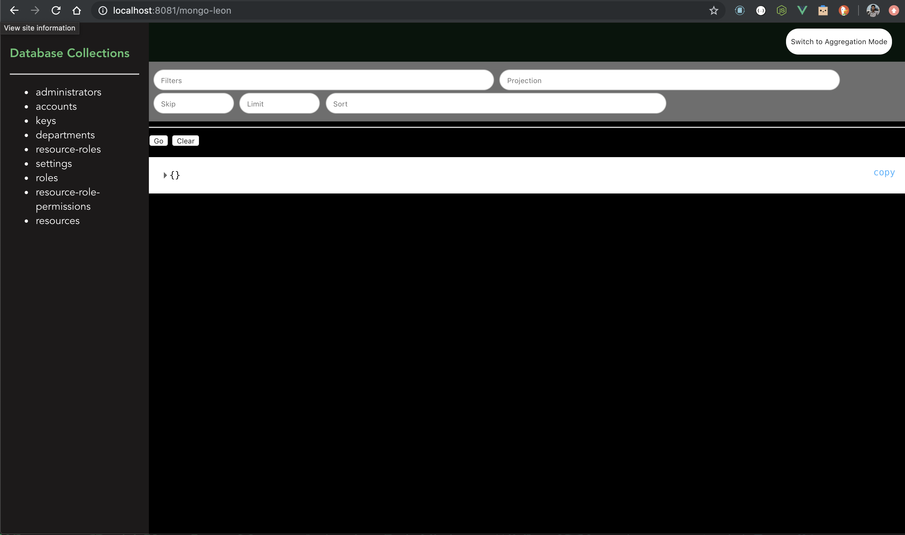
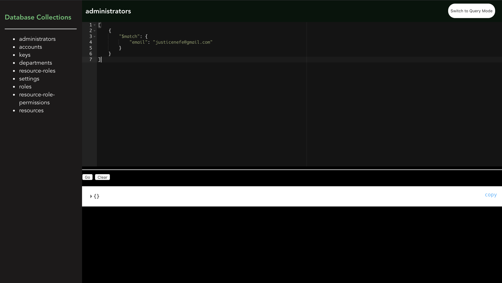

#MongoLeon 
MongoDB Leon, a database command center from the browser. Web alternative to Studio3T and MongoDB Compass

###Usage:
#####// ESM or Babel or TS
>`import MongoLeon from 'mongoleon'`


or

>`const MongoLeon = require('mongoleon')`
```
const express = require('express')

const app = express();

const MongoLeonConfig = {
DBName: 'test',
URL: 'mongodb://localhost:27017/test'
}

app.use(MongoLeon.init(MongoLeonConfig));

app.listen(8080);

```

Visit `http://localhost:8080/mongo-leon` 

Query UI
 

Aggregation UI
 

